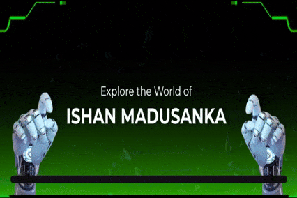

  

  <h1 align="center">👋 Hey there</h1>
  
I am an undergraduate with a passion for problem-solving and continuous learning. Building solutions that matter, one line at a time.

  

             
 

## What I'm Up To

<table align="center">
  <tbody>
    <tr  border="none">
      <td width="50%" align="left">
        <ul dir="auto">
        
Currently, I'm diving deep into:

          <li>Python</li>
          <li>Data Analytics</li>
          <li>AI / Machine Learning</li>
           
          

          I enjoy exploring different programming languages and applying what I learn to develop innovative projects with real-world impact. Each day brings a fresh chance to expand my abilities and take on challenges that help me grow.
        

        </ul>  
      </td>
      <td width="50%" align="center">
        
      </td>
    </tr>
  </tbody>
</table>

             
 

